# ToGather

ToGather is an event-based social media platform that uses geolocation to recommend trendy events according to the user's tastes. The events can be created by either users or communities. Moreover, it also features posts and places with geolocation. It also has a robust filtering system for events, communities, posts, and places. This is the front end of the project.

## Home

You can view your own location and the events, communities, posts, and places on the map. Using the slider on the bottom of the screen, you can navigate recommended items with ease. You can also access search, filtering, and other sections of the app from here.

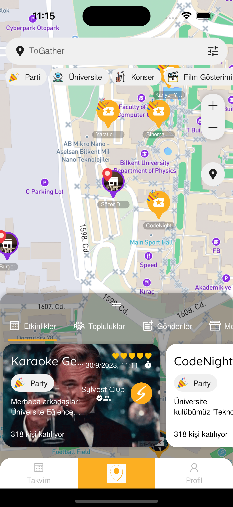

## Filtering

You are able to filter events, users, communities, and posts from here by toggling and selecting a date and tags.

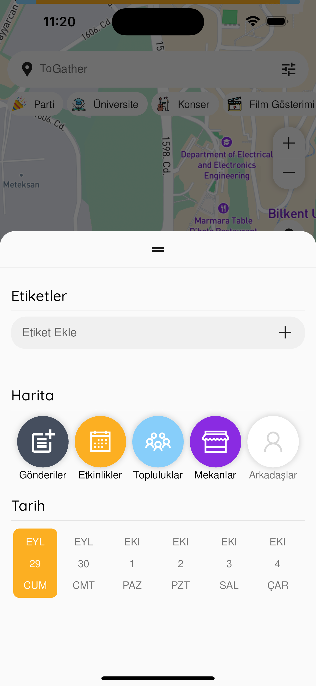

## Search Screen

You are able to enter a keyword which will return results matching the keyword.

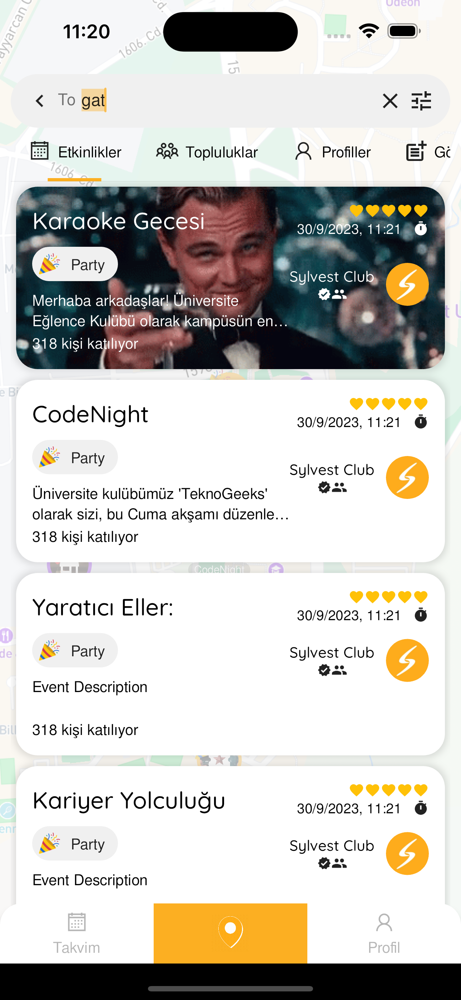

## Create Marker

By tapping any point on the map, you are able to create an item at the desired location.

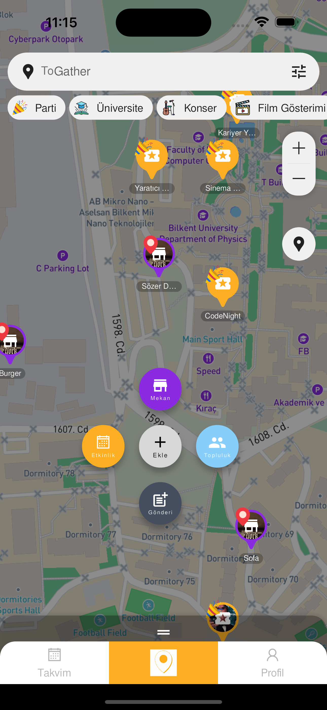

## Dashboard

You are able to view the events that you are attending and hosting in the event calendar, alongside managing your communities, notifications, and the form responses you have provided.

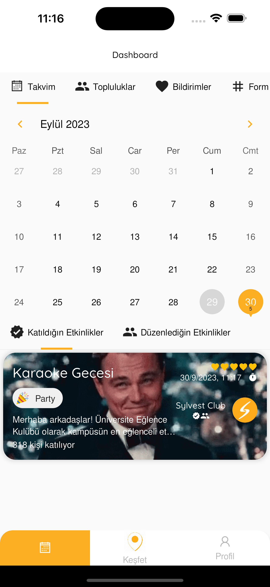

## Friendship

You are able to befriend a user by sending or accepting a friendship request.

## Community Page

Here you are able to view the details of the communities. This details include the number of members, hosted events, and attendee number of those events alongside a description of the community, average rating of its events, and its members with their respective roles. You can also view events and posts of the community here.

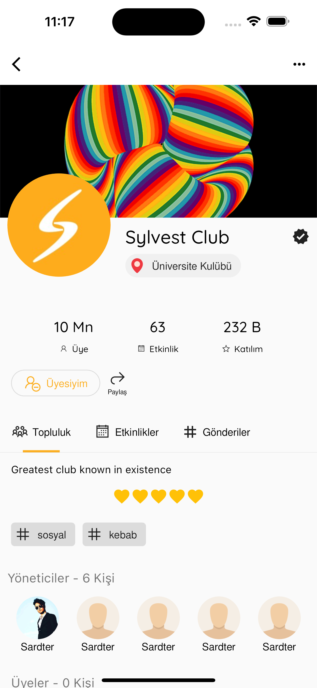
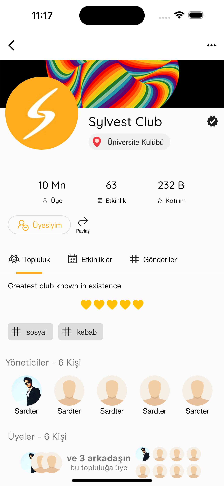

## Event Page

Here you are able to view the details of the events. This details include the number of attendees, alongside a description of the event, average rating provided by the users, location, and the date of the event. You can also view user posts and event media.

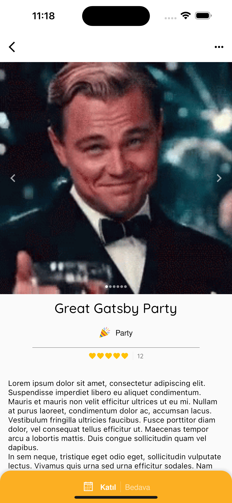
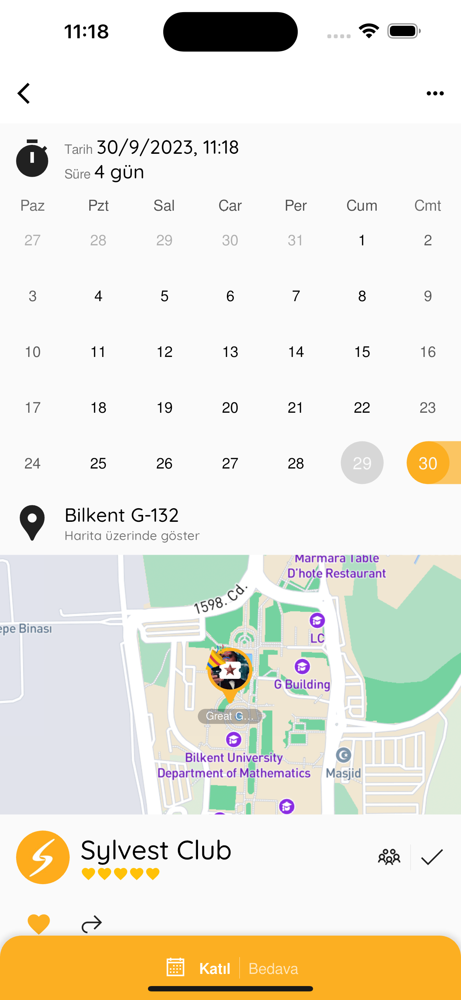

## Post Page

Here you can view post content -including video and images- and comments related to the post. You are also able to create a comment and tag users in it.

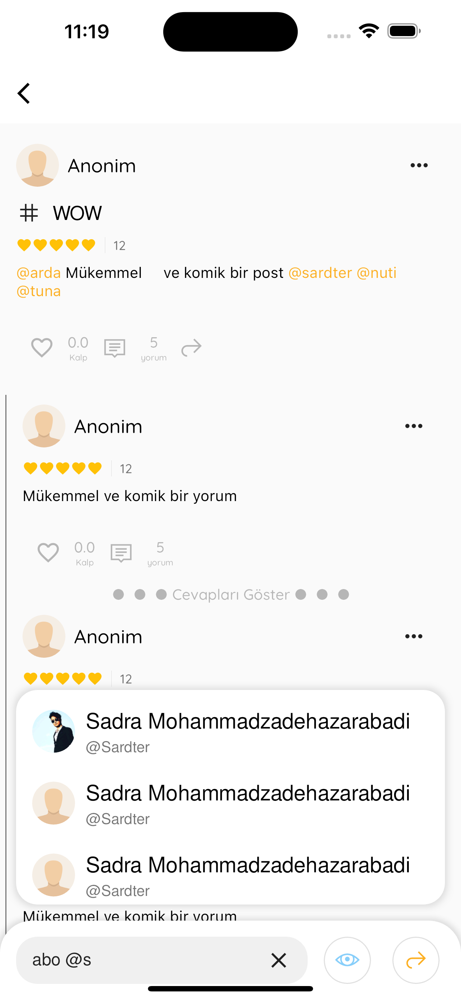

## Rating

You are able to rate posts and events that you have attended.

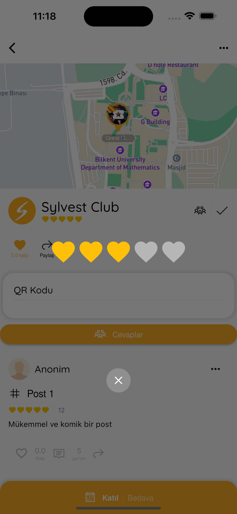

## Profile

You can view different users' pages and edit your own from this page.

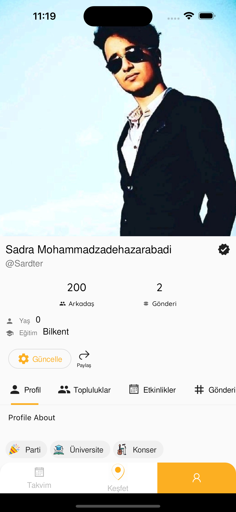

